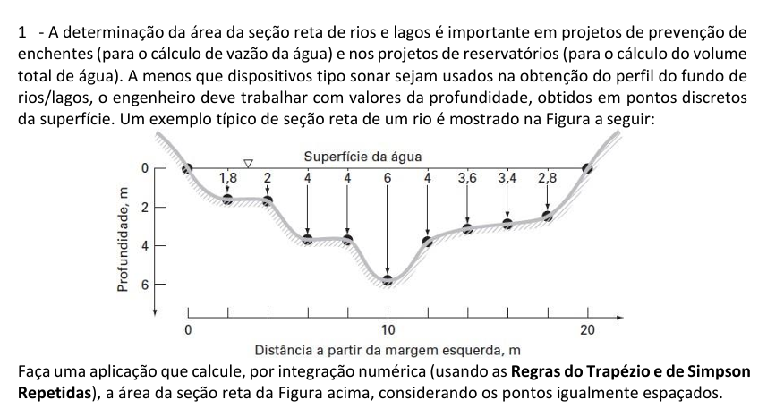

Aqui está o README para a **Questão 1: Integração Numérica**:

---

# Questão 1: Integração Numérica

## Descrição

Este repositório contém a solução da **Questão 1** do trabalho, focada em **Integração Numérica**. Nesta questão, utilizamos métodos numéricos para aproximar a solução de integrais definidas, aplicando algoritmos iterativos para calcular a área sob uma curva.

O objetivo desta questão é obter a aproximação da integral utilizando os seguintes métodos:

- **Método dos Trapézios**
- **Regra de Simpson**

Cada método é implementado para calcular a área com um determinado nível de precisão e comparado quanto à exatidão e eficiência.

### Imagem da Questão



## Estrutura do Projeto

- **`src/`**: Código-fonte da solução em Python.
  - `main.py`: Arquivo principal contendo a implementação dos métodos de integração e a visualização dos resultados.
- **`docs/`**: Documentos de apoio, incluindo a imagem da questão.
  - `Questao1.png`: Imagem fornecida que descreve a questão.

## Requisitos

Antes de executar o projeto, certifique-se de ter instalado:

- **Python 3.x**
- Bibliotecas Python:
  - `numpy`
  - `matplotlib`

Você pode instalar as bibliotecas necessárias usando o `pip`:

```bash
pip install numpy matplotlib
```

## Como Rodar o Projeto

Para executar o código da solução, siga os passos abaixo:

1. **Clone este repositório:**

   ```bash
   git clone https://github.com/Wanjos-eng/CalculoNumerico_IntegracaoNumerica.git
   ```

2. **Navegue até o diretório do projeto:**

   ```bash
   cd nome-do-repositorio
   ```

3. **Instale as dependências necessárias:**

   ```bash
   pip install numpy matplotlib
   ```

4. **Execute o script principal:**

   ```bash
   python src/main.py
   ```

   Isso irá executar o programa que calcula a integral utilizando os métodos dos trapézios e de Simpson, exibindo os valores aproximados e os gráficos da função.

## Resultados

Ao finalizar a execução, serão exibidos os valores das integrais aproximados pelos métodos dos trapézios e de Simpson. Esses resultados serão comparados, permitindo avaliar qual método oferece maior precisão para a função e intervalo especificados.
